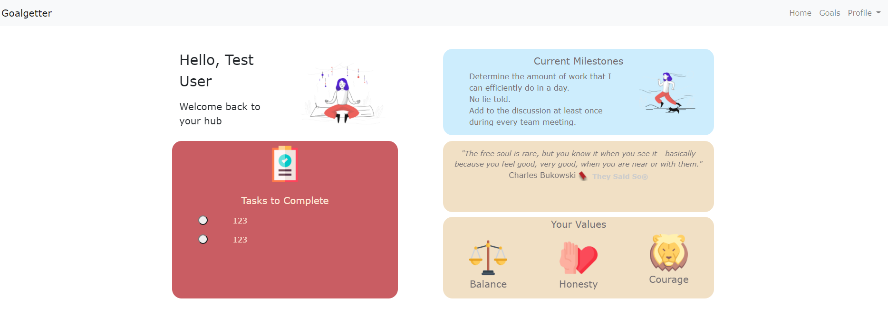

## About The Project
[Goalgetter](https://gentle-bayou-82963.herokuapp.com/) was a web application project built with a focus around two main ideas: core values and achieving annual goals/resolutions. Usually, annual goals/resolutions are very difficult to achieve
because people tend to focus on big picture unrealistic goals that have no clearly defined timeline and process. Additionally, some goals are just harder to achieve than others
because they do not resonate with what your core values are. By merging these two together, we can create goals that are more realistic and achievable and are based on 
what truly matters to you. This is called [value based goal setting](https://www.dummies.com/religion/spirituality/setting-and-achieving-value-based-smart-goals/).

### Languages Used
 * Python
 * Javascript
 * HTML/CSS

### Built With

* [Flask](https://flask.palletsprojects.com/en/2.0.x/)
* [Docker](https://www.docker.com/)
* [Bootstrap](https://getbootstrap.com/)
* [Postgresql](https://www.postgresql.org/)

## Usage

1) Sign up for an account using your email address as a user ID.
2) You will be sent to the questionnaire pages which asks you to determine your: values, goals, milestones, and tasks
3) After finishing the questionnaire successfully, you will be taken to the home page which is a dashboard that contains: your tasks you have to do today,
your current milestones, an inspirational quote, and your values.

* You can view your goals and milestones in the _Goals_ page.
* You can change your name and password for your account in the _Settings_ page.

## License

Distributed under the MIT License. See `LICENSE` for more information.

## Contact

Shing Tze Woo - shingtzewoo@gmail.com

Project Link: [https://github.com/shingtzewoo/goalgetter](https://github.com/shingtzewoo/goalgetter)

<!-- ACKNOWLEDGEMENTS -->
## Acknowledgements

* [Animate CSS](https://animate.style/) -> For animation
* [Nick Janetakis](https://buildasaasappwithflask.com/) -> For Docker and Flask knowledge
* [They Said So Quotes](https://quotes.rest/) -> For free API to produce quotes for dashboard
* [FLat Icon](https://www.flaticon.com/) -> For platform to download icons
* [Icons 8](https://icons8.com/) -> For platform to download illustrations
* [Pixeltrue](https://www.pixeltrue.com/) -> For creating the main illustrations
